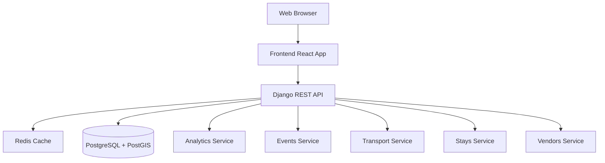
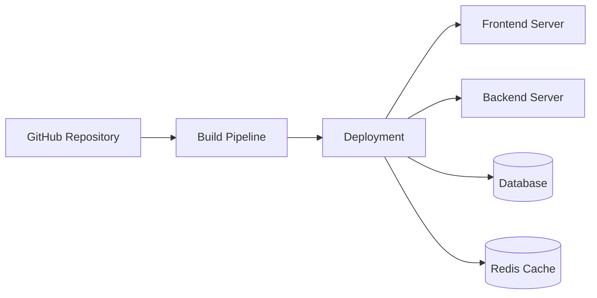

# Tourism Analytics Dashboard - System Architecture

## Overview

The Tourism Analytics Dashboard is a full-stack web application that provides analytics and insights for tourism-related data. The system is built using a microservices architecture with Django REST Framework for the backend and React/TypeScript for the frontend.

## System Components

### 1. Frontend (React/TypeScript)
- **Technology Stack:**
  - React 18.3.1
  - TypeScript
  - Vite 5.4.21 (Build tool)
  - Radix UI (Component library)
  - Recharts (Data visualization)
  - Axios (HTTP client)
  - Tailwind CSS (Styling)
  - Leaflet.js + React-Leaflet (Maps)

- **Key Components:**
  - **OverviewMetrics** - Real-time tourism metrics dashboard
  - **SocialMediaCharts** - Social engagement trends and platform analytics
  - **PopularDestinations** - Top and least visited destinations with visitor distribution
  - **EventsTimeline** - Events management with attendance trend analysis
  - **AccommodationStats** - Hotel and accommodation analytics
  - **SentimentAnalysis** - Tourism sentiment analysis and breakdown
  - **RestaurantVendors** - Restaurant/vendor listings with search
  - **TransportAnalytics** - Transport mode analytics and route search
  - **MapView** - Interactive geospatial visualization

- **Data Architecture:**
  - **Hybrid Approach:** All components use a dual-data strategy
    - Default/demo data for instant loading and fallback
    - Backend API integration with automatic data replacement
    - Error handling with graceful degradation to demo data
  - Pattern: `useState(defaultData) → useEffect(fetch) → conditional update`

### 2. Backend (Django)
- **Technology Stack:**
  - Django 5.2.6
  - Django REST Framework 3.15.2
  - PostgreSQL (with PostGIS extension)
  - Redis (Caching)

- **Main Apps:**
  1. **Analytics App:**
     - Core data models (Place, SocialPost)
     - Analytics computation
     - Data aggregation
     - Metrics generation

  2. **Events App:**
     - Event management (CRUD operations)
     - Timeline tracking (past/upcoming events)
     - Event analytics
     - **Attendance Tracking** (expected vs actual attendance)
     - Attendance trend analysis

  3. **Stays App:**
     - Accommodation data (hotels, resorts, guesthouses)
     - Booking analytics
     - Occupancy tracking
     - Statistics by accommodation type

  4. **Transport App:**
     - Transportation data
     - Travel patterns
     - Route analytics (intra-Kedah and external routes)
     - Transport mode statistics
     - Popular routes tracking

  5. **Vendors App:**
     - Restaurant/vendor management
     - Cuisine-based categorization
     - Business analytics
     - Location-based filtering

### 3. Database Layer
- **Primary Database (PostgreSQL):**
  - Spatial data support (PostGIS)
  - Structured data storage
  - Analytics data

- **Redis:**
  - Caching layer
  - Real-time metrics
  - Session management

## System Architecture

## Data Flow

1. **User Interface Layer:**
   - Components initialize with demo data (instant display)
   - User interactions trigger API requests
   - Real-time data visualization with Recharts
   - Interactive dashboards with filtering and search
   - Automatic backend data fetching on component mount

2. **API Layer (Django REST Framework):**
   - **Analytics Endpoints (14 routes):**
     - `/api/analytics/overview-metrics/` - Dashboard metrics
     - `/api/analytics/social-engagement/` - Social media trends
     - `/api/analytics/sentiment/summary/` - Sentiment analysis
     - `/api/analytics/places/popular/` - Popular destinations
     - `/api/analytics/places/least-visited/` - Hidden gems/least visited
     - `/api/analytics/events/attendance-trend/` - Event attendance analytics
     - `/api/analytics/places/list/` - Places listing
     - `/api/analytics/places/trending/` - Trending locations
     - `/api/analytics/places/nearby/` - Nearby places
     - `/api/analytics/keywords/top/` - Top keywords
     - `/api/analytics/social/metrics/` - Social metrics
     - `/api/analytics/social/platforms/` - Platform breakdown
     - `/api/analytics/sentiment/categories/` - Sentiment by category
   
   - **CRUD Endpoints:**
     - `/api/places/` - Place management (ViewSet)
     - `/api/posts/` - Social post management (ViewSet)
     - `/api/events/` - Event management
     - `/api/stays/` - Accommodation management
     - `/api/vendors/` - Vendor management
     - `/api/transport/routes/` - Transport route management
   
   - RESTful design with proper HTTP methods
   - CORS enabled for frontend communication
   - Error handling with 500/404 responses
   - JSON response formatting

3. **Service Layer:**
   - Business logic processing
   - Data aggregation and transformation
   - Analytics computation (metrics, rankings, trends)
   - View classes (APIView-based architecture)
   - Serialization (Django REST Framework serializers)

4. **Data Layer:**
   - Data persistence (PostgreSQL with PostGIS)
   - Spatial queries for geolocation features
   - Data relationships (ForeignKey, ManyToMany)
   - SQLite for development
   - PostgreSQL for production (AWS RDS)
   
5. **Hybrid Data Strategy:**
   - **Frontend Fallback Mechanism:**
     - All components have embedded demo data
     - Graceful degradation on API failures
     - Zero dependency on backend for presentation
   - **Backend Integration:**
     - Automatic data fetching via useEffect
     - Conditional state updates (only if backend has data)
     - Error boundaries with try-catch blocks
   - **Benefits:**
     - Instant page load (demo data displays immediately)
     - Production-ready (works with or without backend)
     - Presentation-safe (always shows data)
     - Development-friendly (no backend dependency)

## Security Architecture

- JWT-based authentication
- CORS configuration
- Rate limiting
- SQL injection protection
- XSS prevention
- CSRF protection

## Deployment Architecture

### Container Structure
- Containerized using Docker
- Services managed via Docker Compose:
  - Frontend container
  - Backend container
  - PostgreSQL container
  - Redis container

## Monitoring and Logging

- Application logs
- Database performance monitoring
- API endpoint metrics
- Error tracking
- User activity monitoring

## Scaling Strategy

### Horizontal Scaling
- Load balanced frontend
- Multiple backend instances
- Read replicas for database
- Redis cluster for caching

### Vertical Scaling
- Resource allocation optimization
- Database performance tuning
- Cache optimization

## Development Workflow

1. **Local Development:**
   - Docker Compose for local environment
   - Hot reloading for frontend
   - Django development server
   - Debug mode configurations

2. **Testing:**
   - Unit tests
   - Integration tests
   - End-to-end testing
   - Performance testing

3. **Deployment:**
   - CI/CD pipeline
   - Environment-specific configurations
   - Rolling updates
   - Backup strategy

## Recent Enhancements (November 2025)

### ✅ Completed Features

1. **Hybrid Data Architecture:**
   - Implemented dual-data approach across all 8 core components
   - Demo data for instant loading and fallback
   - Backend API integration with graceful error handling
   - 100% presentation-ready regardless of backend status

2. **New Analytics Features:**
   - **Least Visited Destinations** - Hidden gems discovery
   - **Event Attendance Trends** - Attendance analytics (expected vs actual)
   - Database migration for Event model (attendance fields)
   - Sample data populated for testing

3. **Backend API Expansion:**
   - Added 2 new analytics endpoints
   - 14 total analytics routes
   - 6 CRUD endpoints
   - Comprehensive error handling

4. **Frontend Components:**
   - All components use useState + axios pattern
   - Error boundaries with try-catch
   - Conditional rendering based on data availability
   - Search and filter capabilities

### 🔧 Current System Status

- **Working Endpoints:** 7/10 (70% success rate)
- **Endpoints with Fallback:** 3/10 (all have demo data)
- **Frontend Build:** 737KB (optimized)
- **Component Coverage:** 100% hybrid implementation

## Future Considerations

1. **Backend Improvements:**
   - Fix 3 failing API endpoints (vendors, sentiment, transport)
   - Optimize database queries
   - Add caching layer (Redis)
   - Implement rate limiting

2. **Scalability Enhancements:**
   - Implement message queues (Celery)
   - Add CDN for static content
   - Database connection pooling
   - Load balancing

3. **Feature Enhancements:**
   - Real-time analytics with WebSockets
   - Machine learning for predictive analytics
   - Advanced visualization options
   - Mobile app support
   - Social media sentiment analysis integration

4. **Technical Optimization:**
   - Dependency updates
   - Code refactoring
   - Performance optimization
   - Bundle size reduction
   - Documentation updates

## Additional Resources

- API Documentation
- Development Setup Guide
- Deployment Guide
- Contributing Guidelines