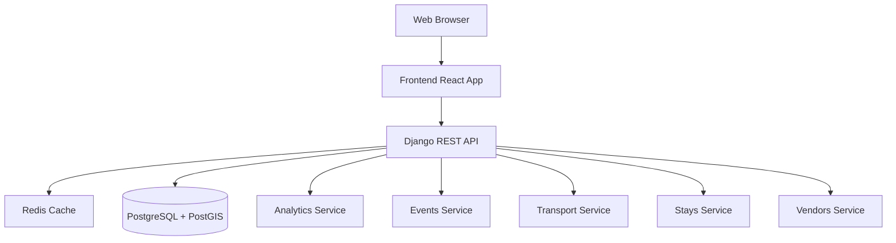
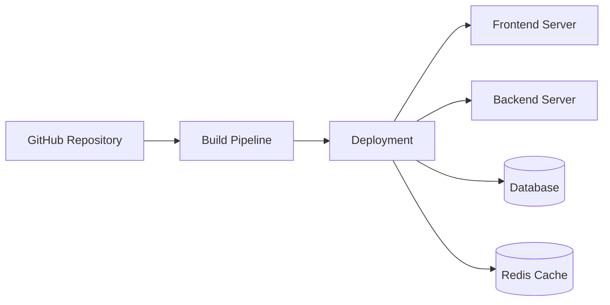

# Tourism Analytics Dashboard - System Architecture

## Overview

The Tourism Analytics Dashboard is a full-stack web application that provides analytics and insights for tourism-related data. The system is built using a microservices architecture with Django REST Framework for the backend and React/TypeScript for the frontend.

## System Components

### 1. Frontend (React/TypeScript)
- **Technology Stack:**
  - React 18.3.1
  - TypeScript
  - Vite (Build tool)
  - Radix UI (Component library)
  - Recharts (Data visualization)

- **Key Components:**
  - Overview Metrics Dashboard
  - Social Media Analytics
  - Popular Destinations
  - Transport Analytics
  - Events Timeline
  - Accommodation Statistics
  - Sentiment Analysis
  - Restaurant/Vendor Analytics
  - Interactive Map View

### 2. Backend (Django)
- **Technology Stack:**
  - Django 5.2.6
  - Django REST Framework 3.15.2
  - PostgreSQL (with PostGIS extension)
  - Redis (Caching)

- **Main Apps:**
  1. **Analytics App:**
     - Core data models (Place, SocialPost)
     - Analytics computation
     - Data aggregation
     - Metrics generation

  2. **Events App:**
     - Event management
     - Timeline tracking
     - Event analytics

  3. **Stays App:**
     - Accommodation data
     - Booking analytics
     - Occupancy tracking

  4. **Transport App:**
     - Transportation data
     - Travel patterns
     - Route analytics

  5. **Vendors App:**
     - Restaurant/vendor management
     - Business analytics
     - Performance metrics

### 3. Database Layer
- **Primary Database (PostgreSQL):**
  - Spatial data support (PostGIS)
  - Structured data storage
  - Analytics data

- **Redis:**
  - Caching layer
  - Real-time metrics
  - Session management

## System Architecture

## Data Flow

1. **User Interface Layer:**
   - User interactions trigger API requests
   - Real-time data visualization
   - Interactive dashboards

2. **API Layer:**
   - RESTful endpoints
   - Authentication/Authorization
   - Request validation
   - Response formatting

3. **Service Layer:**
   - Business logic processing
   - Data aggregation
   - Analytics computation
   - Caching strategy

4. **Data Layer:**
   - Data persistence
   - Spatial queries
   - Data relationships
   - Cache management

## Security Architecture

- JWT-based authentication
- CORS configuration
- Rate limiting
- SQL injection protection
- XSS prevention
- CSRF protection

## Deployment Architecture

### Container Structure
- Containerized using Docker
- Services managed via Docker Compose:
  - Frontend container
  - Backend container
  - PostgreSQL container
  - Redis container

## Monitoring and Logging

- Application logs
- Database performance monitoring
- API endpoint metrics
- Error tracking
- User activity monitoring

## Scaling Strategy

### Horizontal Scaling
- Load balanced frontend
- Multiple backend instances
- Read replicas for database
- Redis cluster for caching

### Vertical Scaling
- Resource allocation optimization
- Database performance tuning
- Cache optimization

## Development Workflow

1. **Local Development:**
   - Docker Compose for local environment
   - Hot reloading for frontend
   - Django development server
   - Debug mode configurations

2. **Testing:**
   - Unit tests
   - Integration tests
   - End-to-end testing
   - Performance testing

3. **Deployment:**
   - CI/CD pipeline
   - Environment-specific configurations
   - Rolling updates
   - Backup strategy

## Future Considerations

1. **Scalability Improvements:**
   - Implement message queues
   - Add CDN for static content
   - Implement database sharding

2. **Feature Enhancements:**
   - Real-time analytics
   - Machine learning integration
   - Advanced visualization options
   - Mobile app support

3. **Technical Debt:**
   - Dependency updates
   - Code refactoring
   - Performance optimization
   - Documentation updates

## Additional Resources

- API Documentation
- Development Setup Guide
- Deployment Guide
- Contributing Guidelines