# Tourism Analytics Dashboard - Entity Relationship Diagram (ERD)

## Complete System Architecture

Generated: 2024
Database: SQLite (Django ORM)
Apps: `users`, `analytics`, `events`, `stays`, `vendors`

---

## Entity Relationship Model (PlantUML Format)

```plantuml
@startuml Tourism_Analytics_Dashboard_ERD

!theme plain
skinparam backgroundColor #FEFEFE
skinparam classBackgroundColor #F5F5F5
skinparam classBorderColor #333333
skinparam arrowColor #333333
skinparam classArrowColor #333333
skinparam noteBkgColor #FFFACD

' ============================================================================
' CORE ENTITY: User (Role-Based Access Control)
' ============================================================================
class User {
  PK: id [Integer]
  email [Email, Unique]
  username [String]
  password_hash [String]
  first_name [String]
  last_name [String]
  
  == Authorization ==
  role [Enum: admin | vendor | stay_owner | place_owner]
  is_approved [Boolean]
  is_active [Boolean]
  is_staff [Boolean]
  
  == Business Claiming ==
  claimed_vendor_id [Integer, FK nullable]
  claimed_stay_id [Integer, FK nullable]
  claimed_place_id [Integer, FK nullable]
  
  == Verification ==
  phone_number [String]
  business_registration_number [String]
  verification_document [File]
  
  == Tracking ==
  admin_notes [Text]
  business_verification_notes [Text]
  created_at [DateTime]
  updated_at [DateTime]
}

' ============================================================================
' TOURISM DESTINATIONS: Place (Points of Interest)
' ============================================================================
class Place {
  PK: id [Integer]
  
  == Identity ==
  name [String]
  description [Text]
  category [String]
  
  == Location ==
  city [String]
  state [String]
  country [String]
  latitude [Float, nullable]
  longitude [Float, nullable]
  
  == Pricing ==
  is_free [Boolean]
  price [Decimal, nullable]
  currency [String]
  
  == Media & External Links ==
  image_url [Text, Base64 or URL]
  wikipedia_url [URL]
  official_website [URL]
  tripadvisor_url [URL]
  google_maps_url [URL]
  
  == Contact & Operations ==
  contact_phone [String]
  contact_email [Email]
  address [Text]
  opening_hours [Text]
  best_time_to_visit [String]
  is_open [Boolean]
  
  == Amenities ==
  amenities [JSONField: {parking, wifi, wheelchair_accessible, ...}]
  
  == Ownership & Status ==
  created_by [FK → User, nullable]
  owner [FK → User, nullable]
  is_council_managed [Boolean]
  is_active [Boolean]
}

' ============================================================================
' SOCIAL MEDIA ANALYSIS: SocialPost
' ============================================================================
class SocialPost {
  PK: id [Integer]
  
  == Post Identity ==
  platform [String]
  post_id [String, Unique with platform]
  url [URL]
  content [Text]
  
  == Timestamps ==
  created_at [DateTime]
  fetched_at [DateTime]
  
  == Engagement Metrics ==
  likes [Integer]
  comments [Integer]
  shares [Integer]
  views [Integer]
  
  == AI Sentiment Analysis ==
  sentiment [Enum: positive | negative | neutral]
  sentiment_score [Float: -1.0 to +1.0]
  confidence [Float: 0-100%]
  
  == Linkage ==
  place [FK → Place, nullable]
  vendor [FK → Vendor, nullable]
  stay [FK → Stay, nullable]
  is_tourism [Boolean]
  
  == Metadata ==
  extra [JSONField: hashtags, language, keywords, ...]
}

' ============================================================================
' RAW POST PROCESSING PIPELINE
' ============================================================================
class PostRaw {
  PK: id [Integer]
  post [FK → SocialPost]
  content [Text]
  metadata [JSONField]
  created_at [DateTime]
}

class PostClean {
  PK: id [Integer]
  raw_post [1-1 FK → PostRaw]
  content [Text]
  sentiment [Enum: positive | neutral | negative]
  keywords [JSONField: List]
  poi [FK → Place, nullable]
  created_at [DateTime]
}

class SentimentTopic {
  PK: id [Integer]
  topic [String]
  sentiment [Enum: positive | neutral | negative]
  count [Integer]
  category [String]
  date [Date]
}

' ============================================================================
' EVENTS & REGISTRATIONS
' ============================================================================
class Event {
  PK: id [Integer]
  
  == Identity ==
  title [String]
  description [Text]
  tags [JSONField: List]
  
  == Schedule ==
  start_date [DateTime]
  end_date [DateTime, nullable]
  recurrence_type [Enum: none | daily | weekly | monthly | yearly]
  recurrence_end_date [Date, nullable]
  parent_event [Self FK, nullable]
  is_recurring_instance [Boolean]
  
  == Location ==
  location_name [String]
  city [String]
  lat [Float, nullable]
  lon [Float, nullable]
  
  == Capacity & Registration ==
  expected_attendance [Integer, nullable]
  actual_attendance [Integer, nullable]
  max_capacity [Integer, nullable]
  requires_approval [Boolean]
  approval_message [Text]
  
  == Custom Forms ==
  registration_form_config [JSONField: List of fields]
  
  == Media & Status ==
  image_url [Text: Base64 or URL]
  is_published [Boolean]
  
  == Ownership ==
  created_by [FK → User, nullable]
}

class EventRegistration {
  PK: id [Integer]
  
  == Participant ==
  user [FK → User, nullable, for guest registrations]
  event [FK → Event]
  
  == Status & Approval ==
  status [Enum: pending | confirmed | rejected | cancelled | waitlist]
  form_data [JSONField: User responses]
  admin_notes [Text]
  reviewed_by [FK → User, nullable]
  reviewed_at [DateTime, nullable]
  
  == Contact Info ==
  contact_name [String]
  contact_email [String]
  contact_phone [String]
  
  == Timestamps ==
  registered_at [DateTime]
  updated_at [DateTime]
}

class EventRegistrationForm {
  PK: id [Integer]
  event [1-1 FK → Event]
  title [String]
  description [Text]
  confirmation_message [Text]
  allow_guest_registration [Boolean]
  created_at [DateTime]
  updated_at [DateTime]
}

class EventRegistrationField {
  PK: id [Integer]
  
  == Form Linkage ==
  form [FK → EventRegistrationForm]
  
  == Field Definition ==
  label [String]
  field_type [Enum: text | textarea | email | phone | number | date | dropdown | checkbox | radio]
  is_required [Boolean]
  placeholder [String]
  help_text [String]
  
  == Validation ==
  options [JSONField: List for dropdowns/radio]
  min_length [Integer, nullable]
  max_length [Integer, nullable]
  pattern [RegEx String, nullable]
  
  == Organization ==
  order [Integer]
  created_at [DateTime]
}

class EventReminder {
  PK: id [Integer]
  user [FK → User]
  event [FK → Event]
  reminder_time [Enum: 1_week | 1_day | 1_hour]
  is_sent [Boolean]
  sent_at [DateTime, nullable]
  created_at [DateTime]
}

' ============================================================================
' ACCOMMODATIONS: Stays
' ============================================================================
class Stay {
  PK: id [Integer]
  
  == Identity & Classification ==
  name [String]
  type [Enum: Hotel | Apartment | Guest House | Homestay]
  district [String]
  landmark [String]
  
  == Location & Distance ==
  lat [Float, nullable]
  lon [Float, nullable]
  distanceKm [Decimal, nullable]
  
  == Rating & Pricing ==
  rating [Decimal: 0-10, nullable]
  priceNight [Decimal, RM]
  
  == Amenities & Features ==
  amenities [JSONField: List]
  images [JSONField: List of URLs]
  main_image [ImageField, nullable]
  
  == Operational Info ==
  is_internal [Boolean]
  is_open [Boolean]
  is_active [Boolean]
  
  == Contact (Internal Stays) ==
  contact_email [Email, nullable]
  contact_phone [String, nullable]
  contact_whatsapp [String, nullable]
  
  == External Booking Integration ==
  booking_com_url [URL, nullable]
  agoda_url [URL, nullable]
  booking_provider [Enum: booking.com | agoda | both | direct]
  
  == Ownership ==
  owner [FK → User, nullable]
}

class StayImage {
  PK: id [Integer]
  stay [FK → Stay]
  image [ImageField]
  caption [String]
  is_primary [Boolean]
  order [Integer]
  uploaded_at [DateTime]
}

' ============================================================================
' FOOD & DINING: Vendors (Restaurants)
' ============================================================================
class Vendor {
  PK: id [Integer]
  
  == Identity ==
  name [String]
  city [String]
  cuisines [JSONField: List]
  description [Text]
  established_year [Integer, nullable]
  
  == Location ==
  lat [Float, nullable]
  lon [Float, nullable]
  address [Text]
  
  == Pricing ==
  price_range [Enum: $ | $$ | $$$ | $$$$]
  
  == Contact ==
  contact_phone [String]
  contact_email [Email]
  
  == Online Presence ==
  official_website [URL]
  facebook_url [URL]
  instagram_url [URL]
  tripadvisor_url [URL]
  google_maps_url [URL]
  
  == Visual Content ==
  logo_url [URL]
  cover_image_url [URL]
  gallery_images [JSONField: List of URLs]
  
  == Features & Operations ==
  amenities [JSONField: {parking, wifi, wheelchair_accessible, ...}]
  delivery_available [Boolean]
  takeaway_available [Boolean]
  reservation_required [Boolean]
  dress_code [String]
  is_halal [Boolean]
  is_open [Boolean]
  is_active [Boolean]
  
  == Tracking ==
  created_at [DateTime]
  updated_at [DateTime]
  
  == Ownership ==
  owner [FK → User, nullable]
}

class MenuItem {
  PK: id [Integer]
  vendor [FK → Vendor]
  name [String]
  description [Text]
  category [String]
  price [Decimal]
  currency [String]
  is_available [Boolean]
  is_vegetarian [Boolean]
  is_halal [Boolean]
  spiciness_level [Integer: 0-5]
  allergens [JSONField: List]
  image_url [URL]
}

class OpeningHours {
  PK: id [Integer]
  vendor [FK → Vendor]
  day_of_week [Integer: 0=Mon-6=Sun]
  open_time [Time]
  close_time [Time]
  is_closed [Boolean]
}

class Review {
  PK: id [Integer]
  vendor [FK → Vendor]
  rating [Integer: 1-5]
  comment [Text]
  author_name [String]
  date [DateTime]
  verified_visit [Boolean]
  food_rating [Integer, nullable]
  service_rating [Integer, nullable]
  ambience_rating [Integer, nullable]
  value_rating [Integer, nullable]
}

class Promotion {
  PK: id [Integer]
  vendor [FK → Vendor]
  title [String]
  description [Text]
  start_date [Date]
  end_date [Date]
  discount_percentage [Integer, nullable]
  discount_amount [Decimal, nullable]
  promo_code [String]
  is_active [Boolean]
}

class Reservation {
  PK: id [Integer]
  vendor [FK → Vendor]
  customer_name [String]
  customer_email [Email]
  customer_phone [String]
  date [Date]
  time [Time]
  party_size [Integer]
  special_requests [Text]
  status [Enum: pending | confirmed | cancelled | completed]
}

' ============================================================================
' RELATIONSHIPS
' ============================================================================

' User relationships
User "1" -- "*" Place: "creates (created_by)"
User "1" -- "*" Place: "owns (owner)"
User "1" -- "*" Event: "creates"
User "1" -- "*" EventRegistration: "registers"
User "1" -- "*" EventRegistration: "reviews (reviewed_by)"
User "1" -- "*" EventReminder: "sets"
User "1" -- "*" Stay: "owns"
User "1" -- "*" Vendor: "owns"

' Place relationships
Place "1" -- "*" SocialPost: "linked in posts"

' Event relationships
Event "1" -- "*" EventRegistration: "receives"
Event "1" -- "1" EventRegistrationForm: "defines form"
Event "1" -- "*" EventReminder: "sets reminders"
Event "1" -- "*" Event: "recurring_instances (via parent_event)"

' EventRegistrationForm relationships
EventRegistrationForm "1" -- "*" EventRegistrationField: "contains"

' SocialPost relationships
SocialPost "1" -- "0..1" PostRaw: "has raw"
PostRaw "1" -- "1" PostClean: "processed to"
SocialPost "1" -- "*" Vendor: "mentions"
SocialPost "1" -- "*" Stay: "mentions"

' Stay relationships
Stay "1" -- "*" StayImage: "contains"

' Vendor relationships
Vendor "1" -- "*" MenuItem: "offers"
Vendor "1" -- "*" OpeningHours: "has"
Vendor "1" -- "*" Review: "receives"
Vendor "1" -- "*" Promotion: "runs"
Vendor "1" -- "*" Reservation: "receives"
Vendor "1" -- "*" SocialPost: "mentioned in"

' Notes
note right of User
  **Authorization System**
  - Role-based access control
  - Admin approval workflow
  - Business claiming fields
  - Verification documents
end note

note right of Place
  **Tourism Destinations**
  - Council-managed or private
  - External resource links
  - Amenities & facilities
  - Linked to social posts
end note

note right of Event
  **Event Management**
  - Recurring events support
  - Custom registration forms
  - Capacity management
  - Approval workflow
  - Attendee reminders
end note

note right of Stay
  **Accommodations**
  - Hybrid: internal + affiliate
  - Multiple images support
  - External booking links
  - Direct contact options
end note

note right of Vendor
  **Food & Dining**
  - Menu management
  - Operating hours
  - Customer reviews
  - Promotions & offers
  - Table reservations
end note

note right of SocialPost
  **Social Media Analysis**
  - Platform-agnostic
  - Sentiment analysis (AI)
  - Multi-entity linkage
  - Engagement metrics
end note

@enduml
```

---

## Entity Inventory by App

### `users` App
| Entity | Purpose | Key FK Relations |
|--------|---------|------------------|
| **User** | Custom auth model with roles | → Place (created_by, owner) → Event (created_by) → Stay (owner) → Vendor (owner) → EventRegistration (user, reviewed_by) |

### `analytics` App
| Entity | Purpose | Key FK Relations |
|--------|---------|------------------|
| **Place** | Tourism destinations (POIs) | ← User (created_by, owner) → SocialPost (place) |
| **SocialPost** | Social media posts with sentiment | ← Place ← Vendor ← Stay → PostRaw, PostClean |
| **PostRaw** | Raw scraped posts | ← SocialPost |
| **PostClean** | Processed posts | ← PostRaw → Place |
| **SentimentTopic** | Aggregated sentiment data | Standalone |

### `events` App
| Entity | Purpose | Key FK Relations |
|--------|---------|------------------|
| **Event** | Events & activities | ← User (created_by) → EventRegistration (event) → EventReminder (event) → EventRegistrationForm (event) → Self (parent_event for recurring) |
| **EventRegistration** | Event attendees/registrations | ← User ← Event → User (reviewed_by) |
| **EventRegistrationForm** | Custom registration form (1:1 with Event) | ← EventRegistrationField |
| **EventRegistrationField** | Individual form fields | Standalone |
| **EventReminder** | Attendee reminder notifications | ← User ← Event |

### `stays` App
| Entity | Purpose | Key FK Relations |
|--------|---------|------------------|
| **Stay** | Accommodations (hotels, apartments, homestays) | ← User (owner) ← SocialPost (stay) → StayImage (stay) |
| **StayImage** | Multiple images per stay | Standalone |

### `vendors` App
| Entity | Purpose | Key FK Relations |
|--------|---------|------------------|
| **Vendor** | Restaurants & food businesses | ← User (owner) ← SocialPost (vendor) → MenuItem (vendor) → OpeningHours (vendor) → Review (vendor) → Promotion (vendor) → Reservation (vendor) |
| **MenuItem** | Food/beverage items | Standalone |
| **OpeningHours** | Operating hours | Standalone |
| **Review** | Customer reviews | Standalone |
| **Promotion** | Special offers & discounts | Standalone |
| **Reservation** | Table booking requests | Standalone |

---

## Relationship Cardinality Summary

### One-to-Many (1:N)
- User → Place (created_by, owner)
- User → Event
- User → EventRegistration (user, reviewed_by)
- User → Stay (owner)
- User → Vendor (owner)
- Place → SocialPost
- Event → EventRegistration
- Event → EventReminder
- EventRegistrationForm → EventRegistrationField
- Vendor → MenuItem
- Vendor → OpeningHours
- Vendor → Review
- Vendor → Promotion
- Vendor → Reservation
- Vendor → SocialPost
- Stay → StayImage
- Stay → SocialPost
- PostRaw → PostClean (1:1 variant)

### Many-to-One (N:1)
- Place ← User (created_by, owner)
- Event ← User (created_by)
- EventRegistration ← User (user, reviewed_by)
- Stay ← User (owner)
- Vendor ← User (owner)
- SocialPost ← Place, Vendor, Stay
- StayImage ← Stay
- MenuItem ← Vendor
- OpeningHours ← Vendor
- Review ← Vendor
- Promotion ← Vendor
- Reservation ← Vendor

### One-to-One (1:1)
- Event ↔ EventRegistrationForm
- PostRaw ↔ PostClean (via OneToOneField)

### Self-Referential
- Event → Event (parent_event for recurring instances)

---

## Authentication & Authorization

**User Roles:**
- `admin` - Full system access
- `vendor` - Can manage vendor profile & menu
- `stay_owner` - Can manage stay/accommodation
- `place_owner` - Can manage tourism place

**Approval Workflow:**
- Vendors & stay owners require `is_approved=True` by admin
- Admins auto-approved in User.save()
- Tracked via `is_approved` boolean

**Business Claiming:**
- User can claim ownership: `claimed_vendor_id`, `claimed_stay_id`, `claimed_place_id`
- Verified via uploaded documents

---

## Key Features by Entity

### 🌍 Places (Analytics App)
✅ Multi-source links (Wikipedia, TripAdvisor, Google Maps)
✅ Amenities JSON field (flexible facility tracking)
✅ Council vs private ownership distinction
✅ Linked to social posts for sentiment analysis

### 🍽️ Vendors (Food & Dining)
✅ Menu management with allergen tracking
✅ Operating hours per day
✅ Customer reviews with breakdown ratings
✅ Promotional offers with discount codes
✅ Table reservations with status tracking
✅ Multi-image gallery support

### 🏨 Stays (Accommodations)
✅ Hybrid: internal (direct booking) + affiliate (Booking.com, Agoda)
✅ Contact info for direct bookings
✅ Multi-image support with primary image
✅ Type classification (Hotel, Apartment, Guest House, Homestay)

### 📅 Events (Event Management)
✅ Recurring events with auto-generation
✅ Custom registration forms with field validation
✅ Approval workflow for registrations
✅ Capacity management
✅ Attendee reminders (1 week, 1 day, 1 hour)
✅ Guest registrations (no login required)
✅ Location-aware (nearby stays & restaurants)

### 📊 Social Media Analysis
✅ Multi-platform support (Instagram, Twitter, etc.)
✅ AI-powered sentiment analysis (-1 to +1 scale)
✅ Confidence scoring (0-100%)
✅ Linked to Places, Vendors, Stays
✅ Engagement metrics tracking (likes, comments, shares, views)
✅ Two-stage processing: PostRaw → PostClean

---

## Data Constraints & Validations

### Place
- `latitude`, `longitude` must be nullable (not all places have GPS)
- `image_url` supports both Base64 and URL formats
- `is_council_managed` determines ownership type

### Event
- `parent_event` must be self-referential (NULL for original events)
- `recurrence_type='none'` for non-recurring or instances
- `max_capacity` can be NULL (unlimited capacity)
- `approval_message` auto-populated if `requires_approval=True`

### EventRegistration
- `user` can be NULL for guest registrations
- `reviewed_by` populated only if `status='confirmed'|'rejected'`
- `contact_email` stored as CharField (not EmailField) to accept any format

### Stay
- `owner` can be NULL for legacy records (before ownership was added)
- `is_internal` determines if `contact_*` fields or booking URLs are used
- Exactly one `main_image` per stay (handled via StayImage.is_primary)

### Vendor
- `amenities` stored as JSONField for flexibility
- `owner` can be NULL for legacy records
- At least one of `delivery_available` or `takeaway_available` must be true

### SocialPost
- Unique constraint: `(platform, post_id)` - prevents duplicate posts
- `place`, `vendor`, `stay` can all be NULL (multi-entity linking)
- `sentiment_score` range: -1.0 (very negative) to +1.0 (very positive)

---

## Database Indexes for Performance

### Place
- `(name)` - for search by name
- `(city, state)` - for geographic filtering

### SocialPost
- `(place, created_at)` - for range queries by place and date
- `(created_at)` - for timeline queries
- Unique: `(platform, post_id)` - prevents duplicates

### Event
- `(city)` - for location-based event search
- `(start_date)` - for timeline queries
- `(recurrence_type)` - for recurring event filtering

### EventRegistration
- `(event, status)` - common approval workflow queries
- `(user)` - for finding user's registrations
- `(contact_email)` - for contact-based lookups

### Vendor
- `(city)` - for location-based restaurant search

### MenuItem
- `(vendor, category)` - for menu browsing
- `(is_available)` - for availability filtering
- `(is_vegetarian)`, `(is_halal)` - dietary filters

### Reservation
- `(vendor, date)` - for booking lookup
- `(status)` - for reservation status tracking

---

## Future Extensions (Not Yet Implemented)

🔄 **Potential Models to Consider:**
- `PlaceReview` - Reviews for places (currently handled via SocialPost sentiment)
- `EventSchedule` - Calendar integration
- `TransportRoute` - Transportation options between locations
- `GuidedTour` - Curated tour packages
- `PaymentTransaction` - Booking payments
- `AnalyticsSnapshot` - Historical metric snapshots

---

**Generated:** Comprehensive system audit complete
**Total Entities:** 24
**Total Relationships:** 40+
**Auth System:** Custom User model with role-based access
**Database:** SQLite (Django ORM)
