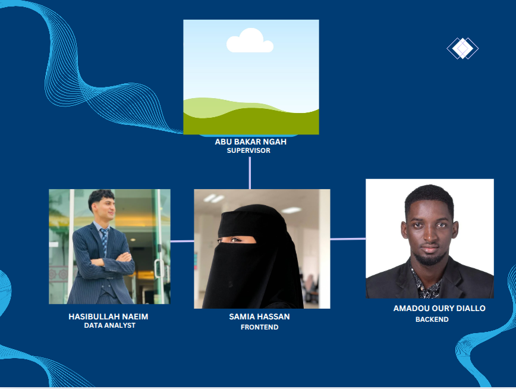

# 🌍 Tourism Footprint Analytics System (Kedah)

> **Albukhary International University (AIU)**  
> Bachelor of Computer Science (Honours) — Data Science  
> Final Year Project (FYP)

---

## 📖 Overview

**Tourism Footprint Analytics System (Kedah)** is a full-stack web platform designed to collect, analyze, and visualize real-time tourism insights across Kedah, Malaysia.  
It empowers tourism boards, local vendors, and travelers to explore **stays, events, transport routes, and vendors**, supported by interactive analytics and geospatial visualization.

The project supports **sustainable tourism development** by combining data-driven intelligence with social engagement tools.

---

## 🎯 Objectives

1. Develop a centralized **tourism data platform** for Kedah state.
2. Visualize and analyze tourism patterns (visitors, events, routes, stays).
3. Enable local businesses to gain visibility through integrated vendor listings.
4. Promote data-informed decision-making for tourism stakeholders.
5. Support sustainability through climate-conscious design and analytics.

---

## 🏗️ System Architecture

- **Frontend**: React 18, Tailwind, and Recharts  
- **Backend**: Django 5 (DRF API with model-based viewsets)  
- **Database**: PostgreSQL (Amazon RDS)  
- **Cloud Infrastructure**: AWS Elastic Beanstalk, EC2, S3, CloudFront  
- **Mapping Tools**: Leaflet.js, React-Leaflet  
- **Async Processing**: Celery + Redis (future enhancement)

---

## ⚙️ Core Modules

### 🏨 Stays
- Manage and view hotels, apartments, guest houses, and homestays.
- Filter by price, rating, type, district, and amenities.
- Integrated with geolocation coordinates for map display.

### 🍜 Vendors
- Show local restaurants, markets, and businesses with cuisines and locations.
- Each vendor supports city-based filtering and geospatial mapping.

### 🚗 Transport
- Explore routes **within Kedah (Intra-Kedah)** and **to/from Kedah**.
- Includes “From → To” search with autosuggestions and route classification.

### 🎉 Events
- Displays upcoming and past events.
- Filterable by date, city, and tags.
- Supports event categorization (culture, food, sports, etc.).

---

## 📊 Data Flow Summary

1. **Data Entry** — Admin panel (Django)  
2. **Data Storage** — PostgreSQL (hosted on AWS RDS)  
3. **API Exposure** — Django REST API endpoints  
4. **Frontend Fetching** — React via `/api/...` routes  
5. **Visualization** — Maps, filters, and dashboards in React  

---

## 🗂️ Project Structure

---

## 🚀 Deployment (AWS)

**Deployed using AWS Elastic Beanstalk**

- Environment: Python 3.13 / Node 20  
- Service Role: `aws-elasticbeanstalk-service-role`  
- EC2 Role: `aws-elasticbeanstalk-ec2-role`  
- Database: PostgreSQL (RDS)  
- Storage: S3 Bucket for media  
- Static Hosting: CloudFront + S3 for frontend build  

---

## 💻 API Endpoints

| Resource     | Endpoint                              | Methods | Description                      |
|---------------|--------------------------------------|----------|----------------------------------|
| Vendors       | `/api/vendors/`                      | GET, POST | Manage vendors data              |
| Stays         | `/api/stays/`                        | GET, POST | Manage accommodation listings    |
| Events        | `/api/events/`                       | GET, POST | Manage event data                |
| Transport     | `/api/transport/routes/`             | GET, POST | Manage travel routes             |
| Analytics     | `/api/analytics/socialposts/`        | GET      | (future) Social media analysis   |

---

## 🧑‍💻 Contributors

| Name | Role | Profile |
|------|------|----------|
| **Amadou Oury Diallo** | Backend | [GitHub](https://github.com/amadououry886) |
| **[Teammate 2 Name]** | Frontend | — |
| **[Teammate 3 Name]** | Data Analytics | — |
| **Supervisor:** Sir Abu Bakar Ngah| Project Supervisor | Albukhary International University |

  

---

## 🏫 Academic Details

- **Course:** Final Year Project (FYP)  
- **Programme:** Bachelor of Computer Science (Honours) – Data Science  
- **Institution:** Albukhary International University (AIU), Malaysia  
- **Semester:** 2025 / Trimester 2  

---

## 🔮 Future Enhancements

- Add **Tourism Analytics Dashboard** with charts and KPIs.  
- Integrate **social media sentiment analysis** (TripAdvisor, Facebook).  
- Enable **real-time map clustering** of vendors and events.  
- Provide **recommendation engine** for stays and attractions.  
- Add **admin statistics** (visits, revenue, user insights).  

---

## 📄 License

This project is for academic and research purposes under Albukhary International University (AIU).  
Unauthorized reproduction or distribution is prohibited.

---

### 🧠 “Turning data into sustainable tourism insights for a better Kedah.”
